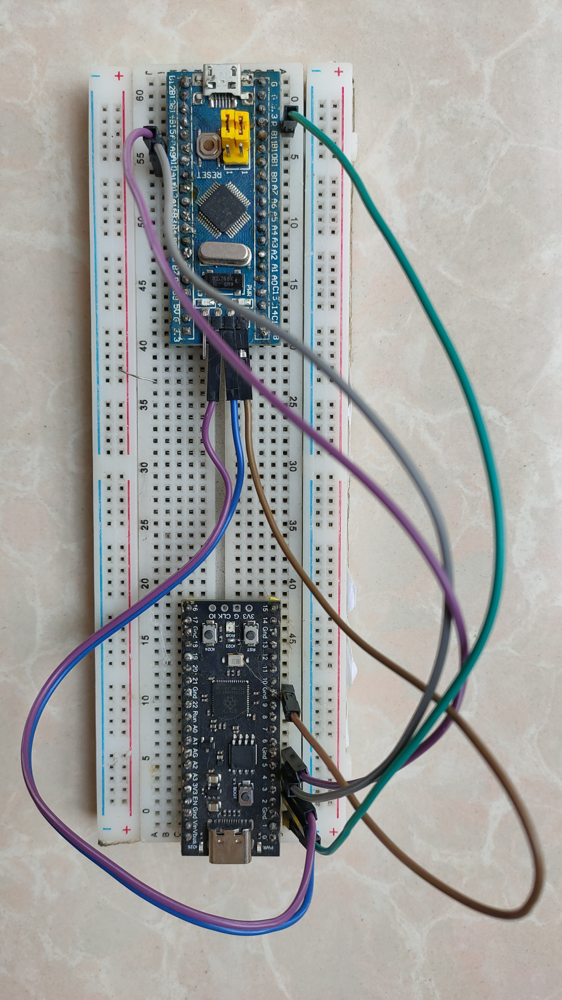

# STM32 Programming with Pico 2


Use **Raspberry Pi Pico 2** as a **SWD Debug Probe** to program an **STM32 Blue Pill (STM32F103)** using **Arduino IDE**.

---

# Table of Contents

- Pico 2 Setup
- Arduino IDE Setup
- Pin Diagram
- Power
- Jumper Position
- Upload

---

# Pico 2 Setup

1. Download `debugprobe.uf2`
2. Press **BOOT/BOOTSEL** and connect to PC
3. Copy the `debugprobe.uf2` to the **RP2350** drive
4. Reset the pico 2 if not automatically done

---

# Arduino IDE Setup

1. In **Arduino IDE** go to **File > Preferences**

2. In the **Additional Boards Manager URLs** field, paste this URL:

```
https://github.com/stm32duino/BoardManagerFiles/raw/main/package_stmicroelectronics_index.json
```

3. Click **OK**

4. Go to **Tools > Board > Boards Manager**

5. Search and download **"STM32 MCU based boards" by STMicroelectronics**

---

## In Tools Menu

```
Board: Generic STM32F1 series
Board Part Number: BluePill F103C6(32KB) [Varies]
U(S)ART support: Enabled (generic 'Serial')
USB support (if available): None
Upload Method: OpenOCD-DAPlink
```

---

# Pin Diagram

```
GPIO 1 > R/RST/NRST
GPIO 2 > SWCLK
GPIO 3 > SWDIO
GPIO 4 > PA10/RX1   //For Serial Monitor
GPIO 5 > PA9/TX1    //For Serial Monitor
```

---

# Power

Power STM32 Seperately if possible

---

# Jumper Position

```
Jumpers > 00
```

---

# Upload

Write and upload code same is any arduino board
Reset the STM32 and enjoy!!!
